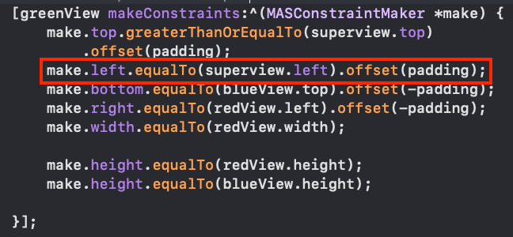
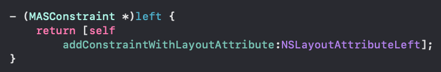
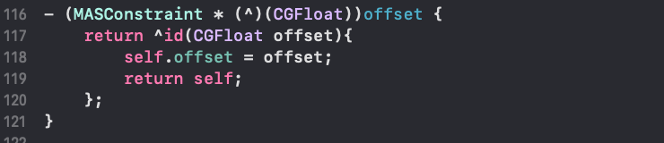
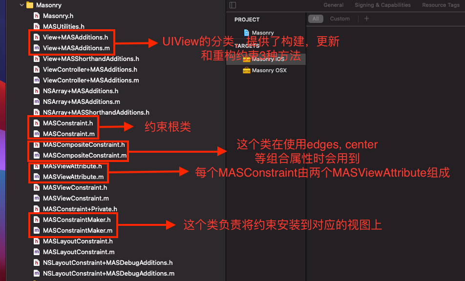

# Masonry源码阅读
Masonry是一个轻量级的布局框架，基于AutoLayout进行封装。简单来说就是Masonry用更简洁的语法描述了一个视图相对另一个视图的位置。

## 点链式语法

Masonry中使用了大量的点链式语法，所以有必要在读源码前了解点链式语法的基本使用

拿block里的一段代码 **make.left.equalTo(superview.left).offset(padding)** 分析下

1. **"."** 相当于调用getter方法，**.left**相当于相当于调用了left方法，left方法定义如下

left方法有返回值，类型是 MASConstraint *

2. 接下来的**equalTo(superview.left)**，在OC语言里调用block会使用()，调用一般的方法使用的是[]，equalTo()定义如下

可以看到equalTo()也是返回block，block有类型也是 MASConstraint * 的返回值

3. 接下来的**offset(padding)** 原理跟**equalTo(superview.left)** 是一样的

> 从2，3两点可以看出，在每次调用完block后如果返回调用者对象本身，就可以实现的调用了。

## Masonry是怎么创建约束和怎么将约束添加到视图上的?

Masonry文件列表如下：

从最基本的使用开始探究代码的流程

- makeConstraints

